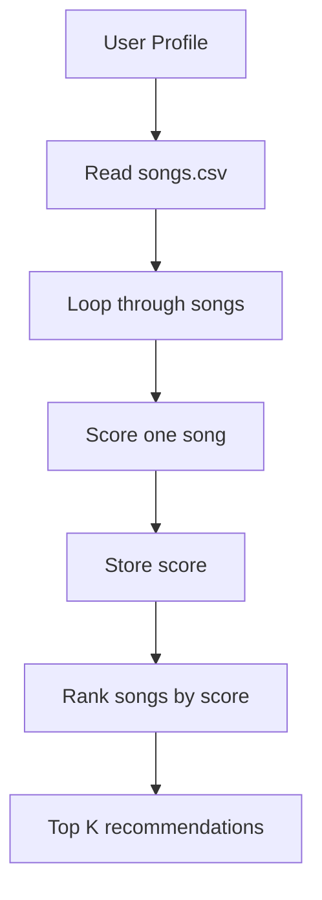
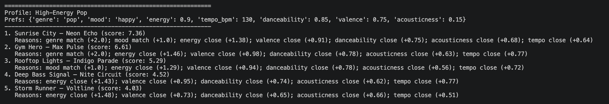
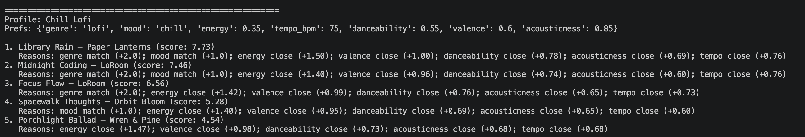
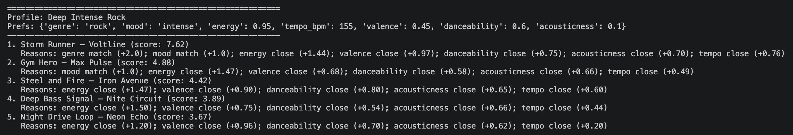
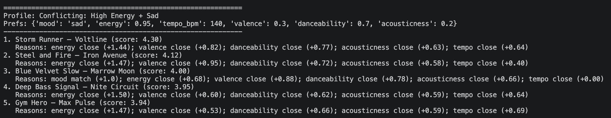
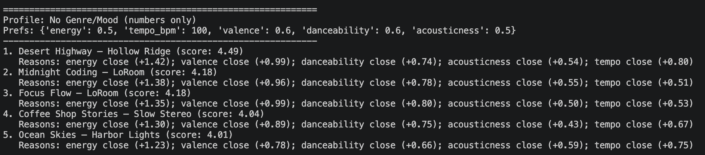
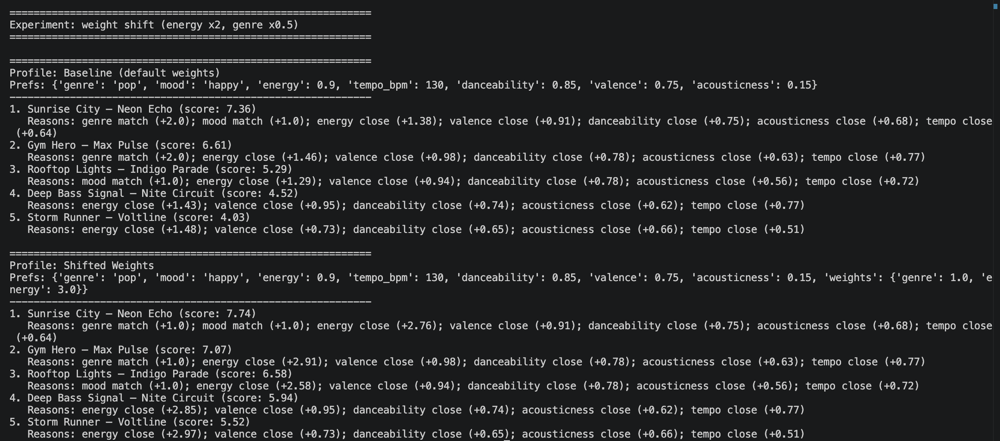

# 🎵 Music Recommender Simulation

## Project Summary

In this project you will build and explain a small music recommender system.

Your goal is to:

- Represent songs and a user "taste profile" as data
- Design a scoring rule that turns that data into recommendations
- Evaluate what your system gets right and wrong
- Reflect on how this mirrors real world AI recommenders

My version is a small, CLI-first music recommender. It loads a catalog of 18 songs from `data/songs.csv`, scores each song against a user taste profile, and prints the top 5 recommendations. Each recommendation includes a score and short “reasons” so you can see why it ranked highly.

---

## How The System Works

Explain your design in plain language.

Some prompts to answer:

- What features does each `Song` use in your system
  - For example: genre, mood, energy, tempo
- What information does your `UserProfile` store
- How does your `Recommender` compute a score for each song
- How do you choose which songs to recommend

You can include a simple diagram or bullet list if helpful.

In real world apps like Spotify, recommendations use lots of user behavior, like what you play, like, skip, or add to playlists. They also use information about songs, like genre, mood, tempo, and energy. My simulation will focus more on song attributes and a user taste profile. It will score each song based on how close it is to the user’s vibe and then recommend the highest scoring songs.

Features included in my simulation:

- `Song` uses: title, artist, genre, mood, energy, tempo_bpm, valence, danceability, acousticness
- `UserProfile` uses: genre, mood, energy, tempo_bpm, valence, danceability, acousticness

Example user profile (taste profile):

```python
user_profile = {
    "favorite_genre": "lofi",
    "favorite_mood": "chill",
    "target_energy": 0.40,
    "target_tempo_bpm": 80,
    "target_valence": 0.60,
    "target_danceability": 0.60,
    "target_acousticness": 0.80,
}
```

Algorithm Recipe (scoring + ranking):

- Start each song at 0 points.
- +2.0 points if the song genre matches `favorite_genre`.
- +1.0 point if the song mood matches `favorite_mood`.
- For numeric features, give more points when the song is closer to the target.
  - Similarity for 0.0–1.0 features: `similarity = 1 - abs(song_value - target_value)`
  - Similarity for tempo: `similarity = 1 - min(abs(song_tempo - target_tempo) / 60, 1)`
- Add weighted similarity points:
  - +1.5 \* energy_similarity
  - +1.0 \* valence_similarity
  - +0.8 \* danceability_similarity
  - +0.7 \* acousticness_similarity
  - +0.8 \* tempo_similarity
- Ranking rule: score every song, sort by score (highest first), and return the top `k` songs.

Mermaid flowchart:



Possible bias in my plan:

- This system might over-prioritize genre and miss good cross-genre matches.
- Since the catalog is small, the recommendations might repeat the same artists or styles.

---

## Getting Started

### Setup

1. Create a virtual environment (optional but recommended):

   ```bash
   python -m venv .venv
   source .venv/bin/activate      # Mac or Linux
   .venv\Scripts\activate         # Windows

   ```

2. Install dependencies

```bash
pip install -r requirements.txt
```

3. Run the app:

```bash
python -m src.main
```

### Running Tests

Run the starter tests with:

```bash
pytest
```

You can add more tests in `tests/test_recommender.py`.

---

## Experiments You Tried

- I tested multiple user profiles (High-Energy Pop, Chill Lofi, Deep Intense Rock).
- I tested edge cases like “High Energy + Sad” and a profile with no genre/mood.
- I ran a weight shift experiment where energy mattered more and genre mattered less.
- The results changed in predictable ways, but a few high-energy songs still showed up often.

## Evaluation Screenshots

Paste your terminal screenshots here after running `python -m src.main`.

### High-Energy Pop



### Chill Lofi



### Deep Intense Rock



### Edge Case: High Energy + Sad



### Edge Case: No Genre/Mood



### Experiment: Shifted Weights



---

## Limitations and Risks

This recommender only works on a tiny catalog, so it cannot represent many tastes. It does not use real listening history, so it cannot learn from a person over time. It can also reward high energy strongly, which makes high-energy songs appear often across profiles. Because it uses fixed weights, small weight changes can shift the ranking a lot.

---

## Reflection

Building this made recommenders feel more familiar to me. Even a simple scoring rule can produce results that feel personal, especially when you include reasons and tune the weights.

AI tools helped me move faster when writing and debugging, but I still had to double-check the math and the CSV data types. The biggest takeaway is that small design choices (like feature weights) can create patterns that feel like a filter bubble.

See the full model card here: [**Model Card**](model_card.md)

---
